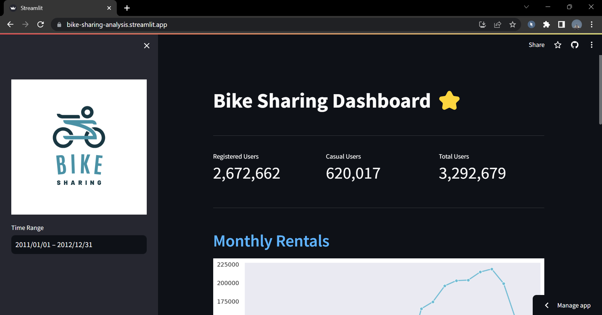
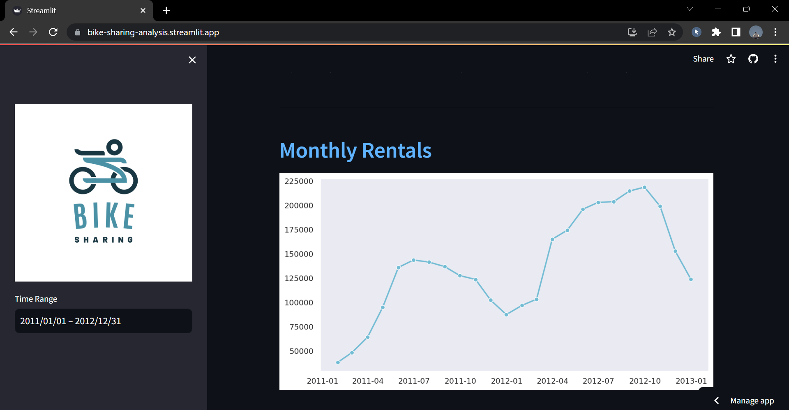
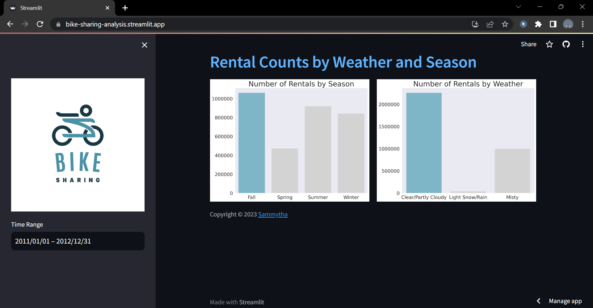

# Bike Sharing Analysis
This is a data analysis project from Dicoding as the final assignment to accomplish the "Belajar Analisis Data dengan Python" course. The project aims to make analysis and create a dashboard from the [Bike Sharing Dataset](https://www.kaggle.com/datasets/lakshmi25npathi/bike-sharing-dataset).

## Getting Started
1. Clone this repository
```
git clone https://github.com/semidust/Bike-Sharing-Analysis.git
```
2. Setup environment
```
conda create --name main-ds python=3.9
conda activate main-ds
pip install pandas matplotlib seaborn jupyter streamlit
```
3. Run streamlit app
```
streamlit run dashboard.py
```

Or access through this link →
[**Bike Sharing Dashboard**](https://bike-sharing-analysis.streamlit.app/)

## Screenshots




