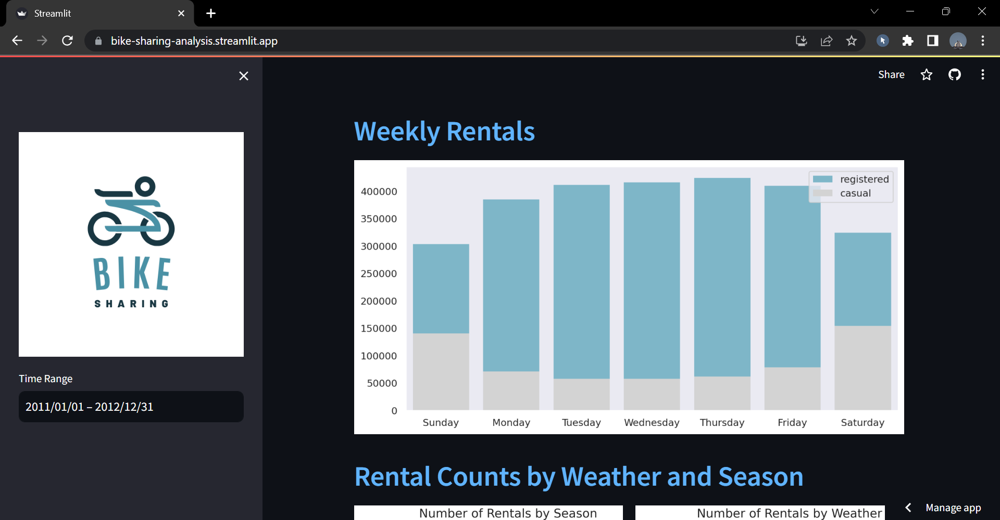

# Bike Sharing Analysis
This is a data analysis project from Dicoding as the final assignment to accomplish the "Belajar Analisis Data dengan Python" course. The project aims to make analysis and create a dashboard.

Dataset Source: [**Bike Sharing Dataset**](https://www.kaggle.com/datasets/lakshmi25npathi/bike-sharing-dataset).
 
Dashboard: [**Bike Sharing Dashboard**](https://bike-sharing-analysis.streamlit.app/)

## Screenshots

